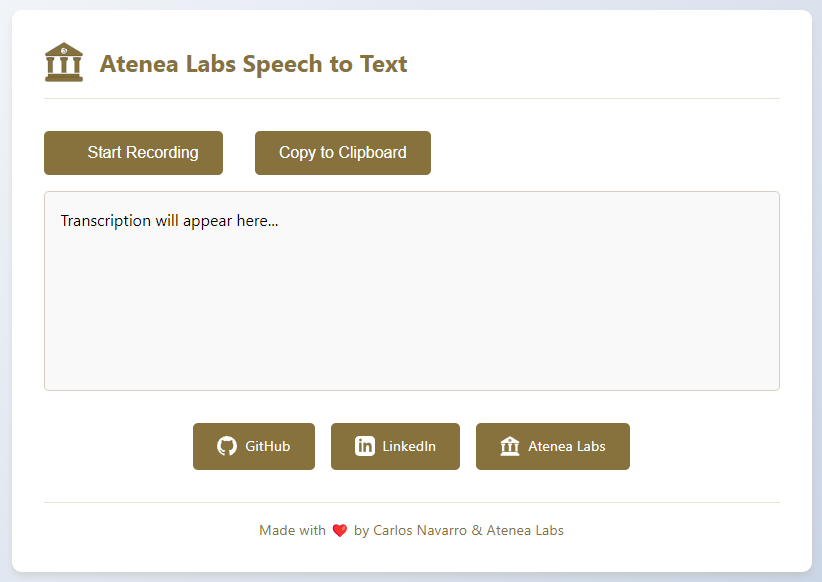

<div align="center">

# 🎙️ Speech to Text - Atenea Labs

[](https://github.com/0xnavarro/speech-to-text/blob/main/LICENSE)
[](https://github.com/0xnavarro/speech-to-text/stargazers)


### 🌟 Transcripción de Voz a Texto en Tiempo Real | Multilenguaje | Intuitivo

[Reportar Bug](https://github.com/0xnavarro/speech-to-text/issues) · [Solicitar Feature](https://github.com/0xnavarro/speech-to-text/issues)

---



</div>

Una herramienta web para transcripción de voz a texto en tiempo real, desarrollada por mi para [Atenea Labs](https://www.atenealabs.com).

## 🎯 Motivación

Este proyecto nació de una necesidad personal: mi teclado se había estropeado y estaba usando uno antiguo que hacía la escritura bastante incómoda. A diferencia de macOS, Windows no tiene una herramienta de dictado de voz integrada que sea realmente efectiva, así que decidí crear esta alternativa utilizando la potencia de Azure Cognitive Services.

## ✨ Características

- Transcripción de voz a texto en tiempo real
- Detección automática de múltiples idiomas
- Interfaz limpia y fácil de usar
- Copiar al portapapeles con un clic
- Visualización del tiempo de grabación

## 🚀 Tecnologías

- React + TypeScript
- Vite
- Azure Cognitive Services (Speech to Text)
- Emotion (CSS-in-JS)

## 🛠️ Configuración

1. Clona el repositorio:
```bash
git clone https://github.com/0xnavarro/speech-to-text.git
cd speech-to-text
```

2. Instala las dependencias:
```bash
npm install
```

3. Crea una cuenta en Azure y configura el servicio de Speech:
   - Ve a [Azure Portal](https://portal.azure.com)
   - Crea un nuevo recurso de Speech Services
   - Obtén la clave, endpoint y la región de tu recurso

4. Configura las variables de entorno:
   - Copia el archivo `.env.example` a `.env`
   - Actualiza el archivo con tus credenciales de Azure:
```env
VITE_AZURE_SPEECH_KEY=tu-clave-aquí
VITE_AZURE_SPEECH_REGION=tu-región-aquí
VITE_AZURE_ENDPOINT=tu-endpoint-aquí
```

5. Inicia la aplicación:
```bash
npm run dev
```

## 💼 Sobre Atenea Labs

Somos una consultoría de inteligencia artificial enfocada en aumentar la productividad de las empresas. Nos especializamos en desarrollar soluciones tecnológicas que ayudan a nuestros clientes a optimizar sus procesos y mejorar su eficiencia.

## 📬 Contacto

- GitHub: [0xnavarro](https://github.com/0xnavarro)
- LinkedIn: [Carlos Navarro](https://www.linkedin.com/in/0xnavarro/)
- Web: [Atenea Labs](https://www.atenealabs.com)

## 📄 Licencia

Este repositorio es de libre uso. Siéntete libre de utilizarlo, modificarlo y distribuirlo según tus necesidades.

---

<div align="center">

# 🎙️ Speech to Text - Atenea Labs [English]

[](https://github.com/0xnavarro/speech-to-text/blob/main/LICENSE)
[](https://github.com/0xnavarro/speech-to-text/stargazers)


### 🌟 Real-time Speech to Text | Multi-language | User-friendly

[Report Bug](https://github.com/0xnavarro/speech-to-text/issues) · [Request Feature](https://github.com/0xnavarro/speech-to-text/issues)

---


</div>

A real-time speech-to-text web tool, developed by me for [Atenea Labs](https://www.atenealabs.com).

## 🎯 Motivation

This project was born from a personal need: my keyboard broke down and I was using an old one that made typing quite uncomfortable. Unlike macOS, Windows doesn't have an effective built-in voice dictation tool, so I decided to create this alternative using the power of Azure Cognitive Services.

## ✨ Features

- Real-time speech-to-text transcription
- Automatic multi-language detection
- Clean and user-friendly interface
- One-click copy to clipboard
- Recording time display

## 🚀 Technologies

- React + TypeScript
- Vite
- Azure Cognitive Services (Speech to Text)
- Emotion (CSS-in-JS)

## 🛠️ Setup

1. Clone the repository:
```bash
git clone https://github.com/0xnavarro/speech-to-text.git
cd speech-to-text
```

2. Install dependencies:
```bash
npm install
```

3. Create an Azure account and set up the Speech service:
   - Go to [Azure Portal](https://portal.azure.com)
   - Create a new Speech Services resource
   - Get your resource key, endpoint, and region

4. Configure environment variables:
   - Copy `.env.example` to `.env`
   - Update the file with your Azure credentials:
```env
VITE_AZURE_SPEECH_KEY=your-key-here
VITE_AZURE_SPEECH_REGION=your-region-here
VITE_AZURE_ENDPOINT=your-endpoint-here
```

5. Start the application:
```bash
npm run dev
```

## 💼 About Atenea Labs

We are an artificial intelligence consultancy focused on increasing business productivity. We specialize in developing technological solutions that help our clients optimize their processes and improve their efficiency.

## 📬 Contact

- GitHub: [0xnavarro](https://github.com/0xnavarro)
- LinkedIn: [Carlos Navarro](https://www.linkedin.com/in/0xnavarro/)
- Web: [Atenea Labs](https://www.atenealabs.com)

## 📄 License

This repository is free to use. Feel free to use, modify, and distribute it according to your needs.

---
Made with ❤️ by Carlos Navarro & Atenea Labs
